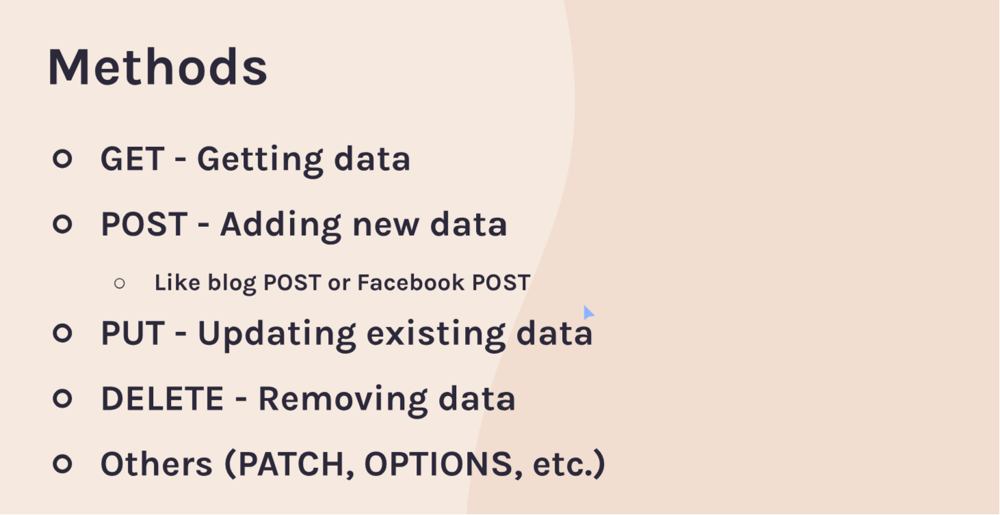
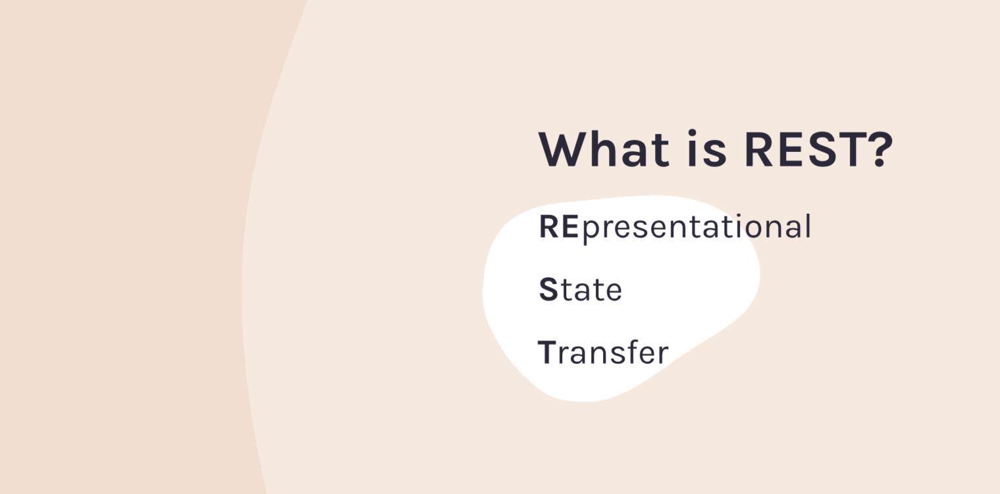
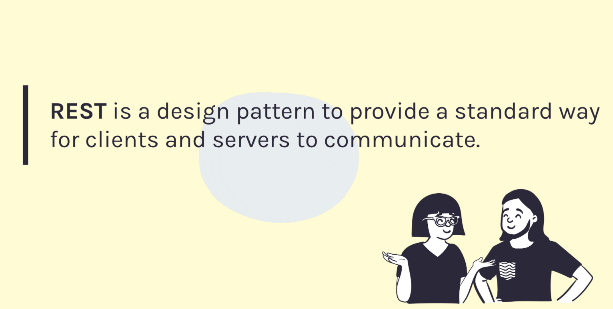
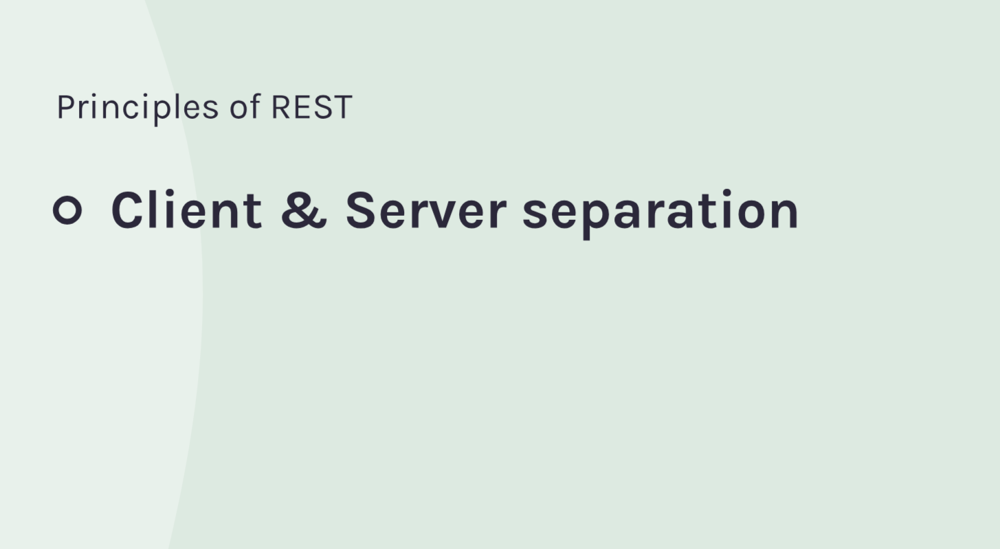
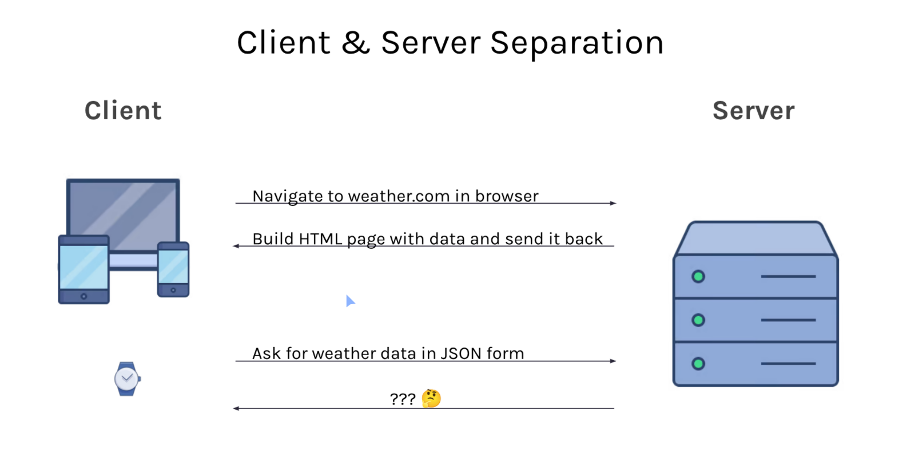
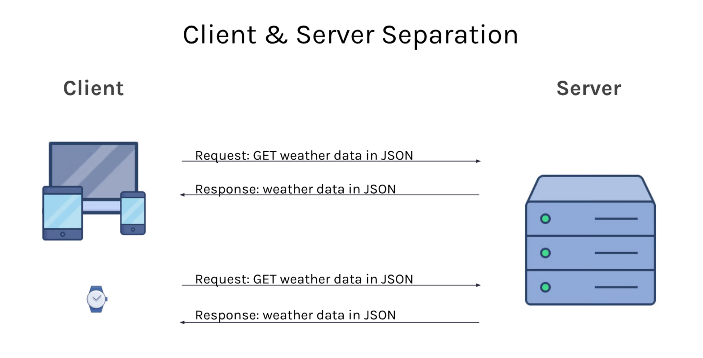

# Blogspace
1. What does HTTP stand for?
- HyperText Transfer Protocol

2. How would you describe what a protocol is to a complete newbie?
- A Protocol is a set of rules that everyone agrees upon to do some task

3. Which part of this URL describes the protocol?: 
https://apis.scrimba.com/jsonplaceholder/posts

- https

4. If you had to guess, which request method (GET, POST, PUT, DELETE) would you
think we made in the previous challenge when we asked for data from the 
JSON Placeholder API?

- GET

1. What's the difference between a Base URL and an Endpoint?
    * Base URL is the part of the URL that won't change, no matter
      which resource we want to get from the API
    * Endpoint specifies exactly which resource we want to get
      from the API

    Given the following URLs from an example API:

    * https://blahblahblah.com/api/v2/users
    * https://blahblahblah.com/api/v2/products
    * https://blahblahblah.com/api/v2/products/123

2. Which part is the Base URL?
    * https://blahblahblah.com/api/v2

3. What are the available endpoints?
/users, /products, /products/ some id of a product here

 
 
 

 

## REST

1. How would you describe what REST is to your non-technical friend?
A standarized way to have your computer, like your laptop, 
get or send information to another computer (like a server)

2. What does a RESTful API usually return in response to incoming requests?
JSON data

3. What kind of client devices can make use of a RESTful API?
ALL OF THEM.

desc

desc

  ### Stateless

1. What does it mean for the server to be "Stateless"?
It means that after serving the request of the client with appropriate resource it will immediately forget about the client.

* In the Mike's Bikes example, what URL endpoint (and request method)
  would you expect to use in order to accomplish the following:
  
    2. Retrieve a list of all the bikes that are sold?
    /bikes
    GET

    3. Retrieve detailed information about the bike with an ID of 42?
    /bikes/42
    GET
    
    4. Update the price of the bike with an ID of 21?
    /bikes/21
    PUT
    
    5. Add a new bike to the list of bikes being sold?
    /bikes
    POST
    
    6. Remove the bike with an ID of 56 from the list of bikes?
    /bikes/56
    DELETE

  ## Nested Resource

  1. How is a nested resource URL like /bikes/123/reviews
   different from an endpoint like /reviews?
   /bikes/123/reviews - return an array of reviews about that specific bike
   /reviews - return an array of all reviews on the site
  
2. What URL might you use to GET the review with an ID of 5 on the bike
   with the ID of 123?
   /bikes/123/reviews/5

3. Describe a "URL Parameter" in your own words:
   Variable inside the URL that acts as a placeholder for the real value
   (Oftentimes they replace the ID of the resource)