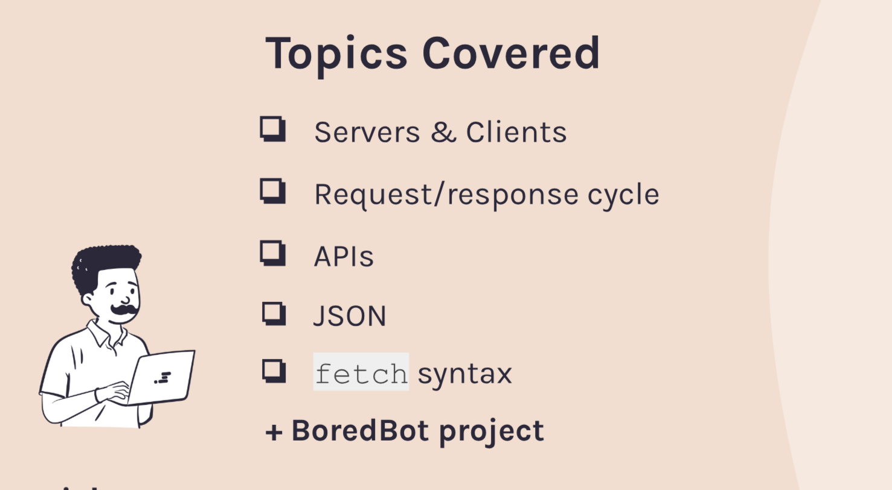

# Bored Bot

## Project Description

Bored Bot is a project that gives suggestions of some activities you can do when you are frrling bored. It sends a request to the boredbot api and displays the activity from the response it gets from the api.

## Contributing

If you want to contribute to Bored Bot, here's how you can do it:

1. Fork the repository
2. Create your feature branch (`git checkout -b feature/fooBar`)
3. Commit your changes (`git commit -am 'Add some fooBar'`)
4. Push to the branch (`git push origin feature/fooBar`)
5. Create a new Pull Request

